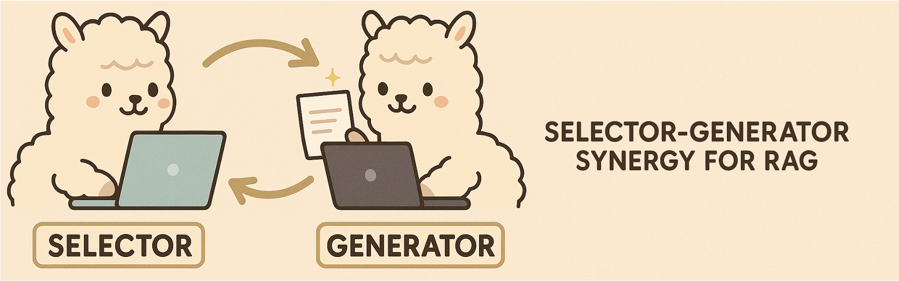

<p align="center">
  
</p>

If you like our project, please give us a star ⭐ on GitHub for the latest update.

<div align="center">
   <h1>Direct Retrieval-augmented Optimization</h1>
</div>


Retrieval-augmented generation (RAG) is powerful but still limited by a lack of synergy between knowledge selection and answer generation process. Our project introduces a novel framework named Direct Retrieval-augmented Optimization (DRO) that brings Selector and Generator into one collaborative loop, allowing them to learn from each other and optimize jointly. Forget one-sided fine-tuning—we enable mutual enhancement for better factuality, relevance, and performance. If you're working on knowledge-grounded LLMs, this is a drop-in upgrade you don't want to miss.

<div align="center">

</div>

## Environment
1. create the `python` env with `conda`
```txt
conda create -n rag python=3.10
conda activate dro
pip install -r requirements.txt
pip install pytrec_eval -i https://pypi.tuna.tsinghua.edu.cn/simple

conda activate dro
```

2. [Optional] set the `vllm` environment variable when using it.
```txt
VLLM_WORKER_MULTIPROC_METHOD=spawn
```

3. [Optional] Please login the `wandb` if use it to record the loss.
```txt
wandb login
```
(`wandb login --relogin` to force relogin)


# Dataset

## Download raw dataset


| Dataset             | Note                                                                                                                                     |                                                     Link                                                      |
| :------------------ |:-----------------------------------------------------------------------------------------------------------------------------------------|:-------------------------------------------------------------------------------------------------------------:|
| Nature Question     | [Natural Questions: A Benchmark for Question Answering Research](https://aclanthology.org/Q19-1026/)                                     | [Github](https://github.com/facebookresearch/DPR/blob/main/dpr/data/download_data.py)<br/>(click the NQ link) |
| HotpotQA            | [HotpotQA: A Dataset for Diverse, Explainable Multi-hop Question Answering](https://arxiv.org/abs/1809.09600)                            |                                    [Homepage](https://hotpotqa.github.io/)                                    |
| MuSiQue             | [MuSiQue: Multihop Questions via Single-hop Question Composition](https://arxiv.org/abs/2108.00573)                                      |                              [Github](https://github.com/StonyBrookNLP/musique)                               |
| 2WikiMultihopQA     | [Constructing A Multi-hop QA Dataset for Comprehensive Evaluation of Reasoning Steps](https://aclanthology.org/2020.coling-main.580.pdf) |                              [Github](https://github.com/Alab-NII/2wikimultihop)                              |
| Wizard of Wikipedia | [Wizard of Wikipedia: Knowledge-Powered Conversational agents](https://arxiv.org/abs/1811.01241)                                         |     [Google drive](https://drive.google.com/file/d/1z327WOKr70rC4UfOlQVBQnuLxChi_uPs/view?usp=share_link)     |

## Retrieval Corpus
We follow previous work and use the Wikipedia as our document corpus, which can be found in [DPR](https://github.com/facebookresearch/DPR/blob/main/dpr/data/download_data.py) repo ([Link](https://dl.fbaipublicfiles.com/dpr/wikipedia_split/psgs_w100.tsv.gz)).
We use the [ColBERT](https://github.com/stanford-futuredata/ColBERT/tree/main) as the retrieval model to pair each query with top-20 documents. The pre-trained ColBERT checkpoint can be downloaded in either its official repo or its [link](https://downloads.cs.stanford.edu/nlp/data/colbert/colbertv2/colbertv2.0.tar.gz).
You can deploy the ColBERT retrieval or other customized retrieval model in your local environment to pre-process the dataset. Or you can download our processed dataset as follows `Training Data Download`.

## Unified the format
We use the code in `./src/prepare/prepare.py` to pre-process the raw datasets. Below shows an concrete example in our reformatted datasets.
```json
{
    "question": "where do the great lakes meet the ocean",
    "answer": "the Saint Lawrence River",
    "positive": [
        "Title: Great Lakes. Content: Great Lakes The Great Lakes (), also called the Laurentian Great Lakes and the Great Lakes of North America, are a series of interconnected freshwater lakes located primarily in the upper mid-east region of North America, on the Canada\u2013United States border, which connect to the Atlantic Ocean through the Saint Lawrence River. They consist of Lakes Superior, Michigan, Huron, Erie, and Ontario, although hydrologically, there are four lakes, Superior, Erie, Ontario, and Michigan-Huron. The lakes are interconnected by the Great Lakes Waterway. The Great Lakes are the largest group of freshwater lakes on Earth by total area, and second largest",
        "Title: Great Lakes. Content: Great Lakes The Great Lakes (), also called the Laurentian Great Lakes and the Great Lakes of North America, are a series of interconnected freshwater lakes located primarily in the upper mid-east region of North America, on the Canada\u2013United States border, which connect to the Atlantic Ocean through the Saint Lawrence River. They consist of Lakes Superior, Michigan, Huron, Erie, and Ontario, although hydrologically, there are four lakes, Superior, Erie, Ontario, and Michigan-Huron. The lakes are interconnected by the Great Lakes Waterway. The Great Lakes are the largest group of freshwater lakes on Earth by total area, and second largest"
    ],
    "query_id": "query_1",
    "retrieval": [
        "Title: \"Great Lakes\" Text:  Great Lakes The Great Lakes (), also called the Laurentian Great Lakes and the Great Lakes of North America, are a series of interconnected freshwater lakes located primarily in the upper mid-east region of North America, on the Canada\u2013United States border, which connect to the Atlantic Ocean through the Saint Lawrence River. They consist of Lakes Superior, Michigan, Huron, Erie, and Ontario, although hydrologically, there are four lakes, Superior, Erie, Ontario, and Michigan-Huron. The lakes are interconnected by the Great Lakes Waterway.",
        "Title: \"Great Lakes\" Text:  The surrounding region is called the Great Lakes region, which includes the Great Lakes Megalopolis. Though the five lakes lie in separate basins, they form a single, naturally interconnected body of fresh water, within the Great Lakes Basin. They form a chain connecting the east-central interior of North America to the Atlantic Ocean. From the interior to the outlet at the Saint Lawrence River, water flows from Superior to Huron and Michigan, southward to Erie, and finally northward to Lake Ontario. The lakes drain a large watershed via many rivers, and are studded with approximately 35,000 islands.",
        "...",
        "Title: \"Great Lakes region\" Text:  The Commission's authorities are confirmed by the Canadian and American federal governments, and by its constituent states and provinces. The states and provinces are represented in the Conference of Great Lakes and St. Lawrence Governors and Premiers. The Great Lakes region takes its name from the corresponding geological formation of the Great Lakes Basin, a narrow watershed encompassing The Great Lakes, bounded by watersheds to the region's north (Hudson Bay), west (Mississippi), east and south (Ohio). To the east, the rivers of St. Lawrence, Richelieu, Hudson, Mohawk and Susquehanna form an arc of watersheds east to The Atlantic."
    ]
}
```


# Our method
## E-step: Permutation Sampling
Running the following two commands to sample the permutation and transform the collect samples into training dataset for the M-step.
```shell
PROCEDURE=offpolicy CUDA_VISIBLE_DEVICES=0,1,2,3,4,5,6,7 VLLM_WORKER_MULTIPROC_METHOD=spawn  \
python ./src/run.py \
    --devices 0,1,2,3,4,5,6,7 \
    --data_path  ./example/nq_train_examples.json \
    --ranker_name  RANKING_MODEL_PATH \
    --generator_name  LLM_GENERATOR_MODEL_PATH \
    --k_positive 0 \
    --k_retrieval 20 \
    --sampling_num 16 \
    --batch_size 16 \
    --cutoff_len 8192 \
    --output_folder  ./example \
    --left 0 \
    --right 1000 
```
Below shows a permutation samples.
```json
{
    "prompt": "You are RankLLM, an intelligent assistant that can rank passages based on their relevance and usefulness to the user's query.\n\nI will provide you with 20 passages. Please rank these passages based on their usefulness in answering the user's search query: \"big little lies season 2 how many episodes\". \n\nA passage's usefulness is defined as:\n1. Relevance to the question.\n2. Contains necessary information to help the user.\n\nThe passages are listed below, each with a numerical identifier [].\nTitle: \"Big Brother 2 (UK)\" Text:  There were a total of 55 episodes this series. This was the first season to feature the spin-off series \"\"Big Brother's Little Brother\"\" (2001\u201310), presented by Dermot O'Leary; Natalie Casey co-presented the series with O'Leary during the first week. \"\"Big Brother Reveals More\"\" (2001) aired solely during this series, and saw the major plot points of the past week being recapped. The series was sponsored by BT Cellnet (now called O2). For the first two series, the house was located in Bow, London near to the 3 Mills Studios.\nTitle: \"I Bet You\" Text:  Most episodes were centered on a big bet (referred to in the title of the episode) of which the development was shown in several pieces. Between those pieces, smaller bets around town were shown. The first season consisted of eight regular episodes and two bonus episodes. The second season premiered on April 10, 2008 at 9:30 PM and concluded its 14 episodes on July 10. Each episode was filmed in a different location, though usually in or around a major American city, such as New York City, Las Vegas or Miami.\nTitle: \"The Big O\" Text:  Along with the 13 episodes of season two, Cartoon Network had an option for 26 additional episodes to be written by Konaka, but according to Jason DeMarco, executive producer for season two, the middling ratings and DVD sales in the United States and Japan made any further episodes impossible to be produced. Following the closure of Bandai Entertainment by parent company in 2012, Sunrise announced at Otakon 2013 that Sentai Filmworks rescued both seasons of \"\"The Big O\"\". On June 20, 2017, Sentai Filmworks released both seasons on Blu-ray.\nTitle: \"The Riches\" Text:  The pilot episode and episode 1.2 (\"\"Believe the Lie\"\") were made available early for online viewing at MSN, Yahoo!, and TV.com at various times. The original airdates (US) are listed here for each episode. A second season of 13 episodes was announced on May 8, 2007 by FX for broadcast in the first half of 2008. It premiered on March 18, 2008. Due to a long writer's strike, only 7 episodes were produced. The pilot episode of \"\"The Riches\"\" drew 3.8 million viewers.\nTitle: \"Little Men (TV series)\" Text:  Filming of the first season took place between August 1998 and January 1999. The second season was filmed from April through October 1999. The series has a total of 26 episodes. Region 1 DVDs of the series distributed by BFS Entertainment in 4 episode installments. BFS has only released the first eight episodes from season one. Episodes 1-4 were also released on VHS by BFS. There is also a Region 4 DVD release from Madmen Entertainment. While being a Canadian production, \"\"Little Men\"\" premiered in the United States on PAX in November 1998.\nTitle: \"The Big O\" Text:  Originally planned as a 26-episode series, low viewership in Japan reduced production to the first 13. Positive international reception resulted in a second season consisting of the remaining 13 episodes; co-produced by Cartoon Network, Sunrise, and Bandai Visual. Season two premiered on Japan's SUN-TV on January 2, 2003, and the American premiere took place seven months later. Following the closure of Bandai Entertainment by parent company Bandai (owned by Bandai Namco Holdings) in 2012, Sunrise announced at Otakon 2013 that Sentai Filmworks rescued both seasons of \"\"The Big O\"\".\nTitle: \"Little People, Big World\" Text:  On October 5, 2012, TLC announced a spin-off series \u2013 \"\"\"\". It chronicles Matt and Amy as they jump-start their wedding business on the farm. The series premiered on November 13, 2012, and ran for six episodes. It was announced in October 2013 that \"\"Little People, Big World\"\" would return for a seventh season. Season seven consists of eight episodes, and premiered on October 29, 2013. An eighth season began on September 2, 2014, and a ninth season began on July 6, 2015.\nTitle: \"Big Brother 1 (UK)\" Text:  The series had a total of 52 episodes, the least amount of episodes for any series thus far. The theme song for the series was produced by Elementfour, and was used for the series intro as well as promotional tools. The series saw the \"\"Little Brother\"\" segment air during select episodes. For the first series, the House was located in Bow, London near the 3 Mills Studios. The House used was a one-story house with two bedrooms, a kitchen and dining room, and one bathroom.\nTitle: \"Reese Witherspoon\" Text:  In January 2016, Witherspoon began filming her first television project since \"\"Return To Lonesome Dove\"\", the seven-part miniseries adaptation of the Liane Moriarty bestseller, \"\"Big Little Lies\"\". She produced the miniseries, along with her co-star, Nicole Kidman, and the show's director, Jean-Marc Vall\u00e9e, her second project under his direction. The series premiered on February 19, 2017 on HBO and finished on April 2. Witherspoon has garnered critical acclaim for her performance, with TV Line proclaiming her as \"\"Performer of the Week\"\" of February 26 to March 4.\nTitle: \"The Hardy Boys\" Text:  The show lasted for only one season of thirteen episodes due to poor ratings; a series based on \"\"Nancy Drew\"\" that ran alongside it in syndication suffered the same fate. Several Hardy Boys video games have been released: In March, 2017 Dynamite Entertainment released Anthony Del Col\u2019s reboot of classic characters Nancy Drew and The Hardy Boys with \"\"NANCY DREW & THE HARDY BOYS: THE BIG LIE\"\". Del Col has been a lifelong fan of the characters and was successful in working with Simon & Schuster to secure the comic book rights and then pitch to publishers.\nTitle: \"Grounded for Life\" Text:  17 episodes were produced for season two, with the addition of the five season one episodes, making it a 22-episode season. Many problems occurred during the production of season three. 19 episodes had been produced for season three, and with Fox cancelling the series later being picked up by The WB, only 11 episodes aired through the two networks, 12 & 13 never aired, and episodes 14 through 19, were included as part of season four. The fourth season originally produced 22 episodes, with the new addition of six from season three, making it the longest season with 28 episodes.\nTitle: \"Degrassi: The Next Generation (season 2)\" Text:  The season finale of season one, \"\"Jagged Little Pill\"\", had been held over, and was shown in an edited format as this season's third episode, along with season two's true third episode to form an hour-long special. Due to the sensitive subject of rape, episodes seven and eight, the \"\"Shout\"\" two-part special, were held over until 11 July 2003 and opened the second half of the season creating an hour-and-a-half long special with episode twenty, \"\"How Soon Is Now?\"\".\nTitle: \"To Tell the Truth\" Text:  There were two \"\"games\"\" per episode, and there was often a live demonstration or video to illustrate the central character's story after many of the games. The show was first released to local stations on September 8, 1969. A total of 1,715 episodes of this version were produced, with the series ending on September 7, 1978. Some markets that added the series after its 1969 release opted to carry the show for another season or two in order to catch up on the episodes that had not aired in their viewing area.\nTitle: \"Little Britain\" Text:  A two-part Christmas special, \"\"Little Britain Abroad\"\", was broadcast in December 2006 and January 2007. This makes a total of 25 episodes to date. There has also been the \"\"Little Britain Live\"\" show. In the UK, the series was originally broadcast on BBC Three and BBC One and was aired in repeats on Dave, Gold, and Watch. In the US and in Bermuda, the series airs on BBC America. BBC Canada aired the program from 3 March 2005 \u2013 present.\nTitle: \"Little Mosque on the Prairie\" Text:  CBC Television renewed the show for a second season consisting of 20 episodes, which began airing on October 3, 2007, and continued to attract an average of one million viewers per episode. CBC renewed the show for a third season on March 7, 2008. Season three premiered on CBC Television October 1, 2008. In its third season ratings declined and as of December 2008 it was attracting a quarter of its original audience. In its fourth season ratings declined further and as of December 2009 it was drawing 420,000 viewers a week, or twenty percent of its original audience.\nTitle: \"The Littles\" Text:  The Littles The Littles is a series of children's novels by American author John Peterson, the first of which was published in 1967. Sixteen years later, Peterson's books were adapted into \"\"The Littles\"\", an animated series by DIC Entertainment. The television show ran on ABC Saturday mornings from September 10, 1983 to November 2, 1985 for three seasons and 29 episodes. In 1985, DiC released an animated feature film spun off the series titled \"\"Here Come the Littles\"\". Similar to Mary Norton's earlier novel \"\"The Borrowers\"\", \"\"The Littles\"\" features a family of tiny, intelligent humanoid creatures with mouse-like features (the Littles) who live in a house owned by the Bigg family.\nTitle: \"Moon TV\" Text:  This season has also seen the return of Season 2's mini-shows (such as Hamsterman from Amsterdam and Bookzone), which were absent in season 3. Series 5 (10 episodes) aired from 7 May to 2 July 2008. Series 6 aired from 25 August to 27 October 2010. In this season, Moon TV goes to New York as the Late Night Big Breakfast is picked up by an American TV Network. However, it fails badly as no one interesting comes on the show, and it eventually gets cancelled.\nTitle: \"Chance in a Million\" Text:  (Or at least was, before it was chewed up by next door's alsatian.) There were three series, each of six episodes, as follows: Series 1 (10 September 1984 \u2013 15 October 1984) Series 2 (6 January 1986 \u2013 10 February 1986) Series 3 (27 October 1986 \u2013 1 December 1986) Speaking about the series following its release on DVD Simon Callow said: \"\"I loved doing it and it's one of the most popular things I ever did. The central character, Tom Chance, was a guy who was plagued by coincidence that was the basic formula of the series.\nTitle: \"My Little Pony Tales\" Text:  It was released \"\"My Little Pony Tales \u2013 The Complete TV Series\"\" on DVD on April 28, 2015. The two-disc set contains all 26 episodes of the series. My Little Pony Tales My Little Pony Tales is an American Saturday-morning animated television series produced by Sunbow Productions and Graz Entertainment, animation produced by AKOM, and based on the My Little Pony toys by Hasbro. It ran weekly on The Disney Channel from August 2, 1992 to December 25, 1992 for 26 episodes. The series also aired in syndication starting in 1993.\nTitle: \"The Big O\" Text:  The first season is episodic. Each episode (referred to as an \"\"Act\"\") relates a separate instance the resurgence of lost \"\"memories\"\" and how the citizens cope with their collective amnesia. The final episodes introduce elements that come into play during season two, like the discovery of people living outside of Paradigm City, the true nature of the Event, and something obliquely described as \"\"the Power of God wielded by the hand of man\"\". While the majority of the first season's episodes are self-contained stories, the second season comprises a single serialized story arc.\n\nRank the 20 passages based on their usefulness in descending order. Use the format [] > [], e.g., [2] > [1]. Only respond with the ranking results; do not provide explanations.\n\nSearch Query: big little lies season 2 how many episodes\nYour output: ",
    "response": "[9] > [20] > [6] > [3] > [11]"
}
```

Further transform the collected samples into training dataset to support the training in M-step. 
```shell
PROCEDURE=weight python ./src/run.py \
--output_folder ./example/
--permutation ./example/nq_permutation.json
--permutation_reward ./example/nq_permutation_reward.device-num=8.0.1000.json
```
The training examples are shown below.
```json
{
    "prompt": "You are RankLLM, an intelligent assistant that can rank passages based on their relevance and usefulness to the user's query.\n\nI will provide you with 20 passages. Please rank these passages based on their usefulness in answering the user's search query: \"big little lies season 2 how many episodes\". \n\nA passage's usefulness is defined as:\n1. Relevance to the question.\n2. Contains necessary information to help the user.\n\nThe passages are listed below, each with a numerical identifier [].\nTitle: \"Big Brother 2 (UK)\" Text:  There were a total of 55 episodes this series. This was the first season to feature the spin-off series \"\"Big Brother's Little Brother\"\" (2001\u201310), presented by Dermot O'Leary; Natalie Casey co-presented the series with O'Leary during the first week. \"\"Big Brother Reveals More\"\" (2001) aired solely during this series, and saw the major plot points of the past week being recapped. The series was sponsored by BT Cellnet (now called O2). For the first two series, the house was located in Bow, London near to the 3 Mills Studios.\nTitle: \"I Bet You\" Text:  Most episodes were centered on a big bet (referred to in the title of the episode) of which the development was shown in several pieces. Between those pieces, smaller bets around town were shown. The first season consisted of eight regular episodes and two bonus episodes. The second season premiered on April 10, 2008 at 9:30 PM and concluded its 14 episodes on July 10. Each episode was filmed in a different location, though usually in or around a major American city, such as New York City, Las Vegas or Miami.\nTitle: \"The Big O\" Text:  Along with the 13 episodes of season two, Cartoon Network had an option for 26 additional episodes to be written by Konaka, but according to Jason DeMarco, executive producer for season two, the middling ratings and DVD sales in the United States and Japan made any further episodes impossible to be produced. Following the closure of Bandai Entertainment by parent company in 2012, Sunrise announced at Otakon 2013 that Sentai Filmworks rescued both seasons of \"\"The Big O\"\". On June 20, 2017, Sentai Filmworks released both seasons on Blu-ray.\nTitle: \"The Riches\" Text:  The pilot episode and episode 1.2 (\"\"Believe the Lie\"\") were made available early for online viewing at MSN, Yahoo!, and TV.com at various times. The original airdates (US) are listed here for each episode. A second season of 13 episodes was announced on May 8, 2007 by FX for broadcast in the first half of 2008. It premiered on March 18, 2008. Due to a long writer's strike, only 7 episodes were produced. The pilot episode of \"\"The Riches\"\" drew 3.8 million viewers.\nTitle: \"Little Men (TV series)\" Text:  Filming of the first season took place between August 1998 and January 1999. The second season was filmed from April through October 1999. The series has a total of 26 episodes. Region 1 DVDs of the series distributed by BFS Entertainment in 4 episode installments. BFS has only released the first eight episodes from season one. Episodes 1-4 were also released on VHS by BFS. There is also a Region 4 DVD release from Madmen Entertainment. While being a Canadian production, \"\"Little Men\"\" premiered in the United States on PAX in November 1998.\nTitle: \"The Big O\" Text:  Originally planned as a 26-episode series, low viewership in Japan reduced production to the first 13. Positive international reception resulted in a second season consisting of the remaining 13 episodes; co-produced by Cartoon Network, Sunrise, and Bandai Visual. Season two premiered on Japan's SUN-TV on January 2, 2003, and the American premiere took place seven months later. Following the closure of Bandai Entertainment by parent company Bandai (owned by Bandai Namco Holdings) in 2012, Sunrise announced at Otakon 2013 that Sentai Filmworks rescued both seasons of \"\"The Big O\"\".\nTitle: \"Little People, Big World\" Text:  On October 5, 2012, TLC announced a spin-off series \u2013 \"\"\"\". It chronicles Matt and Amy as they jump-start their wedding business on the farm. The series premiered on November 13, 2012, and ran for six episodes. It was announced in October 2013 that \"\"Little People, Big World\"\" would return for a seventh season. Season seven consists of eight episodes, and premiered on October 29, 2013. An eighth season began on September 2, 2014, and a ninth season began on July 6, 2015.\nTitle: \"Big Brother 1 (UK)\" Text:  The series had a total of 52 episodes, the least amount of episodes for any series thus far. The theme song for the series was produced by Elementfour, and was used for the series intro as well as promotional tools. The series saw the \"\"Little Brother\"\" segment air during select episodes. For the first series, the House was located in Bow, London near the 3 Mills Studios. The House used was a one-story house with two bedrooms, a kitchen and dining room, and one bathroom.\nTitle: \"Reese Witherspoon\" Text:  In January 2016, Witherspoon began filming her first television project since \"\"Return To Lonesome Dove\"\", the seven-part miniseries adaptation of the Liane Moriarty bestseller, \"\"Big Little Lies\"\". She produced the miniseries, along with her co-star, Nicole Kidman, and the show's director, Jean-Marc Vall\u00e9e, her second project under his direction. The series premiered on February 19, 2017 on HBO and finished on April 2. Witherspoon has garnered critical acclaim for her performance, with TV Line proclaiming her as \"\"Performer of the Week\"\" of February 26 to March 4.\nTitle: \"The Hardy Boys\" Text:  The show lasted for only one season of thirteen episodes due to poor ratings; a series based on \"\"Nancy Drew\"\" that ran alongside it in syndication suffered the same fate. Several Hardy Boys video games have been released: In March, 2017 Dynamite Entertainment released Anthony Del Col\u2019s reboot of classic characters Nancy Drew and The Hardy Boys with \"\"NANCY DREW & THE HARDY BOYS: THE BIG LIE\"\". Del Col has been a lifelong fan of the characters and was successful in working with Simon & Schuster to secure the comic book rights and then pitch to publishers.\nTitle: \"Grounded for Life\" Text:  17 episodes were produced for season two, with the addition of the five season one episodes, making it a 22-episode season. Many problems occurred during the production of season three. 19 episodes had been produced for season three, and with Fox cancelling the series later being picked up by The WB, only 11 episodes aired through the two networks, 12 & 13 never aired, and episodes 14 through 19, were included as part of season four. The fourth season originally produced 22 episodes, with the new addition of six from season three, making it the longest season with 28 episodes.\nTitle: \"Degrassi: The Next Generation (season 2)\" Text:  The season finale of season one, \"\"Jagged Little Pill\"\", had been held over, and was shown in an edited format as this season's third episode, along with season two's true third episode to form an hour-long special. Due to the sensitive subject of rape, episodes seven and eight, the \"\"Shout\"\" two-part special, were held over until 11 July 2003 and opened the second half of the season creating an hour-and-a-half long special with episode twenty, \"\"How Soon Is Now?\"\".\nTitle: \"To Tell the Truth\" Text:  There were two \"\"games\"\" per episode, and there was often a live demonstration or video to illustrate the central character's story after many of the games. The show was first released to local stations on September 8, 1969. A total of 1,715 episodes of this version were produced, with the series ending on September 7, 1978. Some markets that added the series after its 1969 release opted to carry the show for another season or two in order to catch up on the episodes that had not aired in their viewing area.\nTitle: \"Little Britain\" Text:  A two-part Christmas special, \"\"Little Britain Abroad\"\", was broadcast in December 2006 and January 2007. This makes a total of 25 episodes to date. There has also been the \"\"Little Britain Live\"\" show. In the UK, the series was originally broadcast on BBC Three and BBC One and was aired in repeats on Dave, Gold, and Watch. In the US and in Bermuda, the series airs on BBC America. BBC Canada aired the program from 3 March 2005 \u2013 present.\nTitle: \"Little Mosque on the Prairie\" Text:  CBC Television renewed the show for a second season consisting of 20 episodes, which began airing on October 3, 2007, and continued to attract an average of one million viewers per episode. CBC renewed the show for a third season on March 7, 2008. Season three premiered on CBC Television October 1, 2008. In its third season ratings declined and as of December 2008 it was attracting a quarter of its original audience. In its fourth season ratings declined further and as of December 2009 it was drawing 420,000 viewers a week, or twenty percent of its original audience.\nTitle: \"The Littles\" Text:  The Littles The Littles is a series of children's novels by American author John Peterson, the first of which was published in 1967. Sixteen years later, Peterson's books were adapted into \"\"The Littles\"\", an animated series by DIC Entertainment. The television show ran on ABC Saturday mornings from September 10, 1983 to November 2, 1985 for three seasons and 29 episodes. In 1985, DiC released an animated feature film spun off the series titled \"\"Here Come the Littles\"\". Similar to Mary Norton's earlier novel \"\"The Borrowers\"\", \"\"The Littles\"\" features a family of tiny, intelligent humanoid creatures with mouse-like features (the Littles) who live in a house owned by the Bigg family.\nTitle: \"Moon TV\" Text:  This season has also seen the return of Season 2's mini-shows (such as Hamsterman from Amsterdam and Bookzone), which were absent in season 3. Series 5 (10 episodes) aired from 7 May to 2 July 2008. Series 6 aired from 25 August to 27 October 2010. In this season, Moon TV goes to New York as the Late Night Big Breakfast is picked up by an American TV Network. However, it fails badly as no one interesting comes on the show, and it eventually gets cancelled.\nTitle: \"Chance in a Million\" Text:  (Or at least was, before it was chewed up by next door's alsatian.) There were three series, each of six episodes, as follows: Series 1 (10 September 1984 \u2013 15 October 1984) Series 2 (6 January 1986 \u2013 10 February 1986) Series 3 (27 October 1986 \u2013 1 December 1986) Speaking about the series following its release on DVD Simon Callow said: \"\"I loved doing it and it's one of the most popular things I ever did. The central character, Tom Chance, was a guy who was plagued by coincidence that was the basic formula of the series.\nTitle: \"My Little Pony Tales\" Text:  It was released \"\"My Little Pony Tales \u2013 The Complete TV Series\"\" on DVD on April 28, 2015. The two-disc set contains all 26 episodes of the series. My Little Pony Tales My Little Pony Tales is an American Saturday-morning animated television series produced by Sunbow Productions and Graz Entertainment, animation produced by AKOM, and based on the My Little Pony toys by Hasbro. It ran weekly on The Disney Channel from August 2, 1992 to December 25, 1992 for 26 episodes. The series also aired in syndication starting in 1993.\nTitle: \"The Big O\" Text:  The first season is episodic. Each episode (referred to as an \"\"Act\"\") relates a separate instance the resurgence of lost \"\"memories\"\" and how the citizens cope with their collective amnesia. The final episodes introduce elements that come into play during season two, like the discovery of people living outside of Paradigm City, the true nature of the Event, and something obliquely described as \"\"the Power of God wielded by the hand of man\"\". While the majority of the first season's episodes are self-contained stories, the second season comprises a single serialized story arc.\n\nRank the 20 passages based on their usefulness in descending order. Use the format [] > [], e.g., [2] > [1]. Only respond with the ranking results; do not provide explanations.\n\nSearch Query: big little lies season 2 how many episodes\nYour output: ",
    "response": "[9] > [20] > [6] > [3] > [11]",
    "sample_id": 0,
    "query_id": "0",
    "probs": 1.0
}
```
```json
{
    "prompt": "You are an artificial intelligence assistant. You should gives helpful and precise answers to the user\u2019s questions based on the context. The context here refer to external passages related to user's questions.\n\nPlease answer the question: \"big little lies season 2 how many episodes\" using provided passages. Each passage is indicated by a numerical identifier [].\nHere are the related passages for your reference.\n[1] Title: \"Reese Witherspoon\" Text:  In January 2016, Witherspoon began filming her first television project since \"\"Return To Lonesome Dove\"\", the seven-part miniseries adaptation of the Liane Moriarty bestseller, \"\"Big Little Lies\"\". She produced the miniseries, along with her co-star, Nicole Kidman, and the show's director, Jean-Marc Vall\u00e9e, her second project under his direction. The series premiered on February 19, 2017 on HBO and finished on April 2. Witherspoon has garnered critical acclaim for her performance, with TV Line proclaiming her as \"\"Performer of the Week\"\" of February 26 to March 4.\n[2] Title: \"The Big O\" Text:  The first season is episodic. Each episode (referred to as an \"\"Act\"\") relates a separate instance the resurgence of lost \"\"memories\"\" and how the citizens cope with their collective amnesia. The final episodes introduce elements that come into play during season two, like the discovery of people living outside of Paradigm City, the true nature of the Event, and something obliquely described as \"\"the Power of God wielded by the hand of man\"\". While the majority of the first season's episodes are self-contained stories, the second season comprises a single serialized story arc.\n[3] Title: \"The Big O\" Text:  Originally planned as a 26-episode series, low viewership in Japan reduced production to the first 13. Positive international reception resulted in a second season consisting of the remaining 13 episodes; co-produced by Cartoon Network, Sunrise, and Bandai Visual. Season two premiered on Japan's SUN-TV on January 2, 2003, and the American premiere took place seven months later. Following the closure of Bandai Entertainment by parent company Bandai (owned by Bandai Namco Holdings) in 2012, Sunrise announced at Otakon 2013 that Sentai Filmworks rescued both seasons of \"\"The Big O\"\".\n[4] Title: \"The Big O\" Text:  Along with the 13 episodes of season two, Cartoon Network had an option for 26 additional episodes to be written by Konaka, but according to Jason DeMarco, executive producer for season two, the middling ratings and DVD sales in the United States and Japan made any further episodes impossible to be produced. Following the closure of Bandai Entertainment by parent company in 2012, Sunrise announced at Otakon 2013 that Sentai Filmworks rescued both seasons of \"\"The Big O\"\". On June 20, 2017, Sentai Filmworks released both seasons on Blu-ray.\n[5] Title: \"Grounded for Life\" Text:  17 episodes were produced for season two, with the addition of the five season one episodes, making it a 22-episode season. Many problems occurred during the production of season three. 19 episodes had been produced for season three, and with Fox cancelling the series later being picked up by The WB, only 11 episodes aired through the two networks, 12 & 13 never aired, and episodes 14 through 19, were included as part of season four. The fourth season originally produced 22 episodes, with the new addition of six from season three, making it the longest season with 28 episodes.\nQuestion: big little lies season 2 how many episodes\nYour answer: ",
    "response": "seven",
    "sample_id": 0,
    "query_id": "0",
    "probs": 1.0
}
```
We provide example files on `./example` folder.

## M-step: Maximization
```shell
TRAINER=weight PROCEDURE=train CUDA_VISIBLE_DEVICES=0,1,2,3,4,5,6,7  nohup torchrun  --nproc_per_node=8 --master_port=11020 ./src/run.py \
    --model_name_or_path  \
    --dataset_name_or_path TRAINING_DATASET_PATH \
    --deepspeed ./scripts/ds_z3_config.json \
    --output_dir ../output/ \
    --overwrite_cache True \
    --warmup_ratio 0.1 \
    --report_to wandb \
    --run_name test_run \
    --logging_steps 1 \
    --cutoff_len 8192 \
    --max_samples 50000 \
    --save_steps 200 \
    --per_device_train_batch_size 2 \
    --gradient_accumulation_steps 8 \
    --learning_rate 2.0e-5 \
    --num_train_epochs 3 \
    --lr_scheduler_type cosine \
    --bf16 True
```

## Warmup learning for answer generator and document selector

The warm-up learning aims to initialize the LLM with basic skills, which can fit the LLM into downstream tasks better.
In this work, we achieve the warm-up for both answer generator and document selector through supervised fine-tuning.

1. To achieve the warm-up of answer generator, you can download the dataset from our [Google drive](https://drive.google.com/file/d/1VN8fnFvNj6DmlMaf4qE_cWBVkd72_Zp-/view?usp=sharing) to train the base LLM.

2. To achieve the warm-up of document selector, please download generative ranking dataset from [RankZephyr](https://huggingface.co/datasets/castorini/rank_zephyr_training_data) to train the base LLM.

# Evaluation on Benchmarks

We evaluate our method using the `EM` and `F1` metrics. We use the evaluation scripts from official [KILT](https://github.com/facebookresearch/KILT/blob/main/kilt/eval_downstream.py).

The main experiment results are as follows, where we compare the proposed DRO with **25+ baselines** on a wide range of benchmarks, including open-domain QA, multi-hop QA and knowledge-grounded dialogue tasks.

<p align="center">
  
</p>

## Pre-processed Data

### Download pre-processed evaluation data

You can directly download our pre-processed benchmarks. We process these benchmark into a unified format, which is more convenient for evaluation.

| File                  | Note                                                  |                                                Link                                                |
| :-------------------- | :---------------------------------------------------- |:--------------------------------------------------------------------------------------------------:|
| nq_dev.json           | Pre-processed data of the NQ dataset                  | [Google drive](https://drive.google.com/file/d/1hp6SjahfoLLmnjNnahyVFkxPDlnmErTO/view?usp=sharing) |
| hotpotqa_dev.json     | Pre-processed data of the HotpotQA dataset            | [Google drive](https://drive.google.com/file/d/1DaWl5SV0KvIUHEIk5MO4tSn7jeWDsLTI/view?usp=sharing) |
| musiqueqa_dev.json    | Pre-processed data of the MuSiQue  dataset            | [Google drive](https://drive.google.com/file/d/1zPXhLAOe1ktDqJDmxNoRLMQ2ml-Jup-6/view?usp=sharing) |
| wikimultihop_dev.json | Pre-processed data of the 2WikimultihopQA dataset     | [Google drive](https://drive.google.com/file/d/1HAjSFswVDmmfJIAXo4qMLjtAUB8YWjD1/view?usp=sharing) |
| wow_dev.json          | Pre-processed data of the Wizard-of-Wikipedia dataset | [Google drive](https://drive.google.com/file/d/1B2qSjEzR5w_AG1nZQVEKzeLbCvOCQPLd/view?usp=sharing) |

### Download pre-processed training data

You can directly download our pre-processed training data. We process these benchmark into a unified format, which is more convenient for evaluation.

| File                    | Note                                             |                                                Link                                                |
| :---------------------- | :----------------------------------------------- |:--------------------------------------------------------------------------------------------------:|
| nq_train.json           | Training data of the NQ dataset                  | [Google drive](https://drive.google.com/file/d/1hw_h2gsroJZiWKRiBb2aIaXGjy1Wvgdw/view?usp=sharing) |
| hotpotqa_train.json     | Training data of the HotpotQA dataset            | [Google drive](https://drive.google.com/file/d/1GxE-1psv-ksoY313Dq1qgYA98vw7t2JQ/view?usp=sharing) |
| musiqueqa_train.json    | Training data of the MuSiQue  dataset            | [Google drive](https://drive.google.com/file/d/1REtwkyPwLVL7NVXPvHJ9ezYletsmhSwK/view?usp=sharing) |
| wikimultihop_train.json | Training data of the 2WikimultihopQA dataset     | [Google drive](https://drive.google.com/file/d/1D6PRMwaj-7ilXajz70OP54h8KNWwOV8l/view?usp=sharing) |
| wow_train.json          | Training data of the Wizard-of-Wikipedia dataset | [Google drive](https://drive.google.com/file/d/1bv6BK_eWRch60gP5rJ-Q_gPbUQI_EOxZ/view?usp=sharing) |

### 


## Acknowledgement

We sincerely thank prior work, including [RankGPT](https://github.com/sunnweiwei/RankGPT) and [Llama-Factory](https://github.com/hiyouga/LLaMA-Factory/tree/main).
